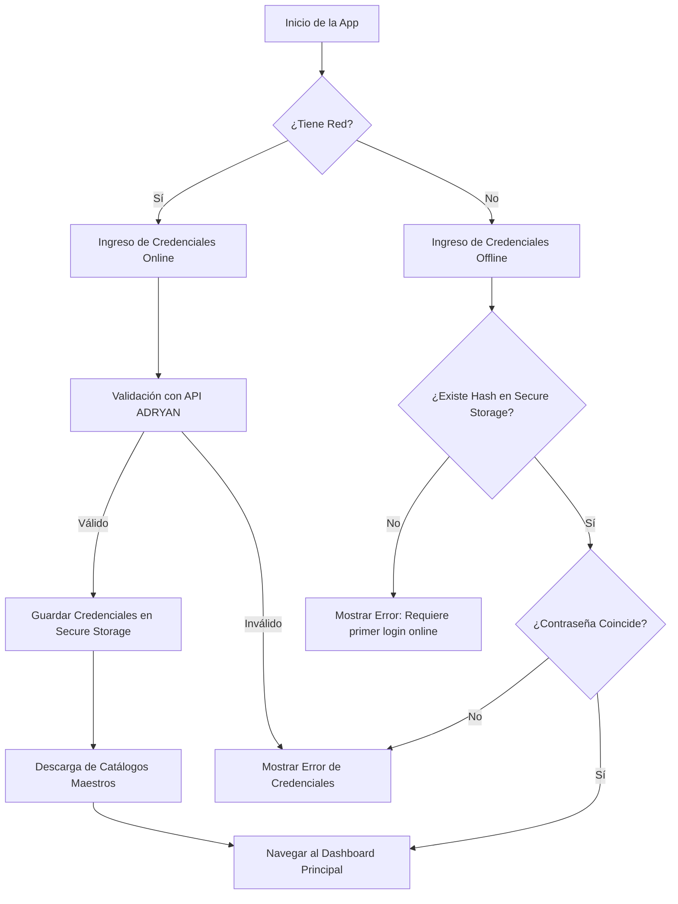
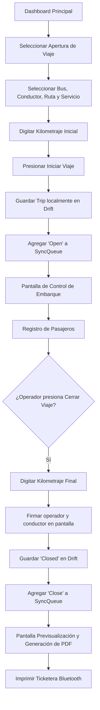
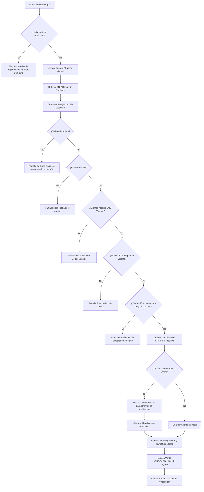

# Flujos de Usuario: APP Buses (Miski Mayo)

Este documento contiene los flujos visuales y de interacción humana con la aplicación móvil en formato secuencial y diagramas Mermaid.

## 1. Flujo de Autenticación e Inicio de Sesión
Este flujo muestra el ciclo de vida del inicio de sesión, permitiendo la operación offline basada en credenciales previamente validadas.

---

## 2. Ciclo de Vida del Viaje (Trip Lifecycle)
El flujo que sigue el operador para abrir, gestionar el aforo y cerrar un viaje.

---

## 3. Flujo del Control de Abordaje (Escaneo de Pasajero)
Flujo detallado de validación de cada pasajero al escanear o buscar manualmente su DNI/Fotocheck.

